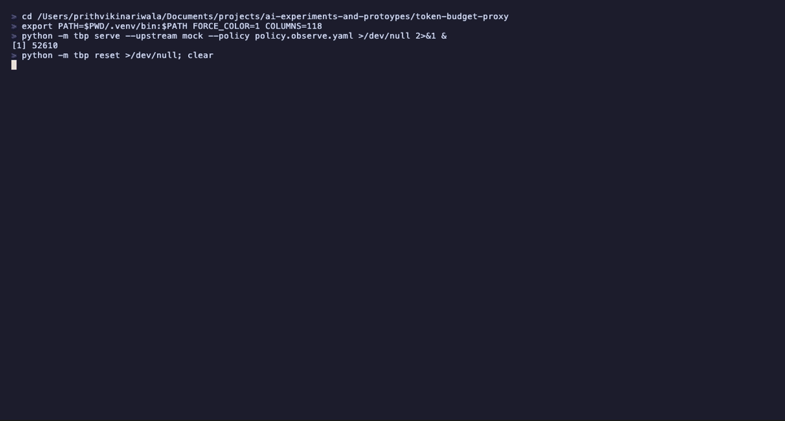

# token-budget-proxy

I kept running agents in loops and had no idea where the money went. So I put a
proxy in front of the Messages API that logs every call, enforces a budget, and
tells me what I wasted it on.

The first thing it found was a timestamp in a system prompt that was silently
destroying the prompt cache on every single request.



Prompt caching is a prefix match on exact bytes. One volatile value anywhere in
the prefix and everything after it is uncacheable — no error, no warning, just a
bill. Finding that by reading code is miserable. Finding it by diffing two
recorded prefixes takes milliseconds.

## What it does

Three things, in the order you should adopt them.

**Meter.** Every call is recorded with its full `usage` — uncached input, cache
writes, cache reads, output — costed per model and attributed to an agent, a
session, and a task. This is the part everything else depends on. Note that
`input_tokens` is the *uncached remainder*, not the prompt size; reading it as
the total is the most common way to under-count an agent's real spend.

**Govern.** A YAML policy evaluated before the request leaves the machine.
Budgets cap cumulative spend per agent per window. Rules rewrite or reject
individual requests — route a task class to a cheaper model, cap effort for
sub-agents, add a cache breakpoint to a large prefix, refuse the expensive model
outright.

**Audit.** Six analysers over the ledger, each producing a finding with a dollar
figure and the evidence behind it.

| Finding | What it catches |
|---|---|
| `cache-invalidated` | A breakpoint that never hits — locates the first differing byte between two prefixes, or identifies TTL expiry when the prefix is stable |
| `cache-absent` | A repeated prefix over the model's minimum with no breakpoint at all |
| `dead-tools` | Tool definitions re-sent on every call and never once invoked |
| `truncation-retry` | Responses cut off at `max_tokens` — billed in full, unusable, then retried |
| `model-oversized` | Short tool-free answers on a frontier model: the shape of classification, not reasoning |
| `context-bloat` | A session's prompt growing turn over turn as old tool results are re-read |

## Try it

No API key needed — `--upstream mock` runs a local simulator that models how
`usage` responds to caching, including the model-specific minimum cacheable
prefix size and TTL expiry.

```bash
python -m venv .venv && .venv/bin/pip install -e ".[dev]"

.venv/bin/python demo/compare.py
```

That runs one workload three ways:

```
              same workload, three configurations
┏━━━━━━━━━━━━━━━━━━━┳━━━━━━━━━━┳━━━━━━━━━━━━━━━━━┳━━━━━━━━━━━━━┓
┃                   ┃ baseline ┃ policy enforced ┃ agent fixed ┃
┡━━━━━━━━━━━━━━━━━━━╇━━━━━━━━━━╇━━━━━━━━━━━━━━━━━╇━━━━━━━━━━━━━┩
│ spend             │  $0.3349 │         $0.2719 │     $0.2027 │
│ vs baseline       │       -- │            -19% │        -39% │
│ policy rewrites   │        0 │              37 │           0 │
│ findings          │        6 │               4 │           2 │
│ still recoverable │  $0.2712 │         $0.0741 │    $0.00796 │
└───────────────────┴──────────┴─────────────────┴─────────────┘
```

The middle column is the point. The agent's source is byte-identical to the
baseline; 19% came from configuration alone. The third column is the ceiling —
what is left once someone actually edits the code.

Two things that column deliberately does not hide:

- **`report-writer` gets more expensive.** Raising a `max_tokens` ceiling that
  was truncating every response costs more and is unambiguously correct: the
  cheaper runs were paying in full for answers that stopped mid-sentence. A
  spend tool that only ever reports reductions is measuring the wrong thing.
- **The cache invalidator survives policy enforcement.** No proxy can fix a
  timestamp inside someone's system prompt without changing what the model is
  told. The report can only point at the byte and hand it to a human. Knowing
  which findings are self-service and which are not is most of the value.

Or drive it by hand:

```bash
.venv/bin/python -m tbp serve --upstream mock --policy policy.observe.yaml &
.venv/bin/python demo/agent.py sloppy
.venv/bin/python -m tbp report
.venv/bin/python -m tbp calls
```

Point any client at it — the proxy speaks the Messages API, so nothing else
changes:

```python
client = anthropic.Anthropic(
    base_url="http://127.0.0.1:8787",
    default_headers={"x-tbp-agent": "doc-triage", "x-tbp-task": "classify"},
)
```

To run against the real API, drop `--upstream mock` and set `ANTHROPIC_API_KEY`.
The proxy will use its own key if the client does not send one, so an agent can
run with no credential of its own.

## Policy

```yaml
budgets:
  window: day
  default: 5.00
  agents:
    doc-triage: 1.00
    "subagent-*": 0.50

rules:
  - name: cheap-classification
    when: {task: classify}
    then: {model: claude-sonnet-5, effort: low}

  - name: cache-large-prefixes
    when: {min_prefix_tokens: 1024}
    then: {ensure_cache_control: true}

  - name: no-truncating-ceilings
    when: {has_tools: false}
    then: {max_tokens_floor: 16000}
```

Rules compose rather than first-match-wins — a request can legitimately need
both a model downgrade and an effort cap, and making the author order their
rules to get both would be a footgun. Unknown conditions and actions raise
rather than being skipped silently; a policy typo that quietly disables a
control is worse than a crash at startup.

`policy.observe.yaml` is the configuration to start with: attribute and cost
everything, change nothing. You cannot govern spend you have not measured, and a
proxy that starts rewriting requests on day one will be blamed for the next
unrelated regression.

## Design notes

**Requests are forwarded as raw HTTP, not through the SDK.** A proxy has to pass
through fields it does not know about, including ones added after it was
written. Round-tripping an arbitrary request body through typed models would
silently drop them. The demo agent uses the official SDK, which is also the
point: the proxy is transparent to it.

**Streaming is metered without being altered.** Bytes are relayed verbatim while
`usage` is read out of `message_start` and `message_delta` in passing. The
ledger write happens in a `finally`, so a client that disconnects mid-stream is
still billed for what upstream already generated.

**Pre-flight estimates use characters ÷ 4, not `count_tokens`.** An accurate
count costs a round trip per call, which would defeat the purpose. Rules only
ever compare a request against itself before and after a rewrite, where a
consistent bias cancels out.

**`context-bloat` reports no dollar figure.** How much of a session's history is
still load-bearing is a judgement about the task, not something the ledger can
see. Every other analyser can show its arithmetic; this one can't, so it
reports the trend and stops. A guess with a dollar sign in front of it is worse
than no number.

## Tests

```bash
.venv/bin/python -m pytest tests -q     # 28 tests
```

The cost arithmetic and the cache analysers carry the most coverage, on the
principle that a spend tool reporting a confident wrong number is worse than no
tool at all.

## Regenerating the GIF

```bash
brew install vhs
vhs demo/demo.tape
```

The recording is scripted rather than captured by hand, so it can be re-rendered
whenever the output changes instead of quietly going stale.

## Limitations

- The mock upstream models token accounting, not model behaviour. Response
  content is synthetic; only the `usage` numbers are meant to be believed.
- Batch API pricing is implemented but nothing routes to it yet.
- `dead-tools` apportions a call's tool-definition tokens evenly across the
  declared tools rather than measuring each definition, so its dollar figure is
  approximate. It is flagged medium, never high.
- Costing assumes first-party API rates. Bedrock and Vertex are priced
  separately and would need their own table.
- Prompt prefixes are stored in full to make the byte-diff possible. That is
  fine for local use and would need a retention policy anywhere else.
